[English](#english) | [中文](#chinese)

<a name="chinese"></a>
# webcool：面向个人与私有环境的全能文件管理控制台

webcool 已经从一个文件上传下载示例，发展成了一套运行在浏览器里的私有文件工作台。它可以管理远程虚拟磁盘，也可以直接浏览服务器本机磁盘；可以预览图片、视频、音频、PDF、文本、Markdown、HTML、Office 和 XMind 文件；还提供标签树、加锁保护、回收站、批量操作、转码、图片编辑、用户管理、存储迁移、备份同步和个人偏好设置。

如果你希望在自己的电脑、家庭服务器、工作站或私有云中搭建一个轻量但功能完整的文件管理系统，webcool 已经具备了从日常使用到长期运维所需的核心能力。

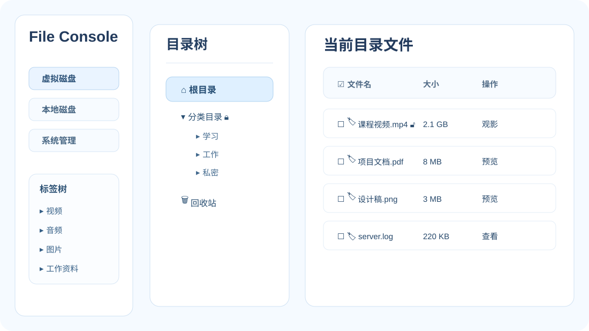

## 功能总览

webcool 的主界面由左侧功能导航和右侧工作区组成，核心能力可以概括为：

- **虚拟磁盘**：管理 webcool 上传目录中的私有文件空间，支持目录树、文件列表、上传、下载、复制、移动、改名、删除、恢复和彻底删除。
- **本地磁盘**：通过浏览器浏览服务器本机文件系统，支持列表/分栏模式、隐藏文件开关、排序、复制、移动、改名、删除到系统回收站和调用本地应用打开。
- **标签树**：用多级标签跨目录组织远程文件和本地文件，标签视图下的移除只解除引用，不删除真实文件。
- **预览中心**：图片、视频、音频、PDF、文本、Markdown、HTML、Office 文档和 XMind 思维导图都可以直接打开查看。
- **安全机制**：远程回收站、本地系统回收站、目录锁、文件锁、标签锁、会话解锁和后端接口校验共同保护数据。
- **系统管理**：支持存储路径切换、迁移进度、冲突处理、备份路径、上传数据自动同步、本地磁盘策略、语言和字体大小。
- **账号体系**：提供登录、退出、改密码、用户管理和用户偏好保存，管理员能力与普通用户能力区分。
- **手机移动端**：提供 iPhone 和 Android 原生客户端，可在同一 Wi-Fi 下发现服务器，浏览虚拟磁盘/服务器磁盘，上传相册或文件，预览文档和多媒体，并共享同一套登录、标签、锁和缓存能力。

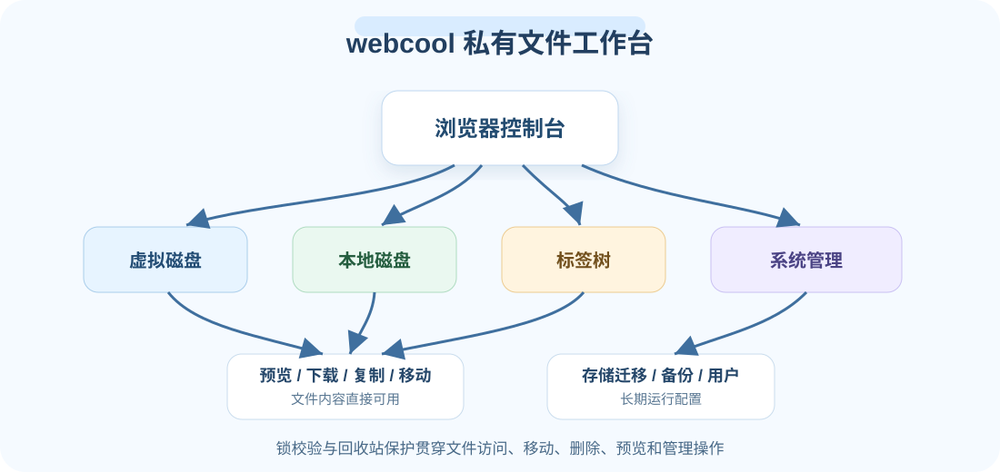

## 一、虚拟磁盘：像资源管理器一样管理私有文件空间

虚拟磁盘是 webcool 的核心文件管理区域。用户可以在浏览器中查看远程存储目录、创建目录、重命名目录、复制/移动目录、删除目录到回收站，并对文件执行预览、下载、改名、复制、移动、删除、加标签和加锁等操作。

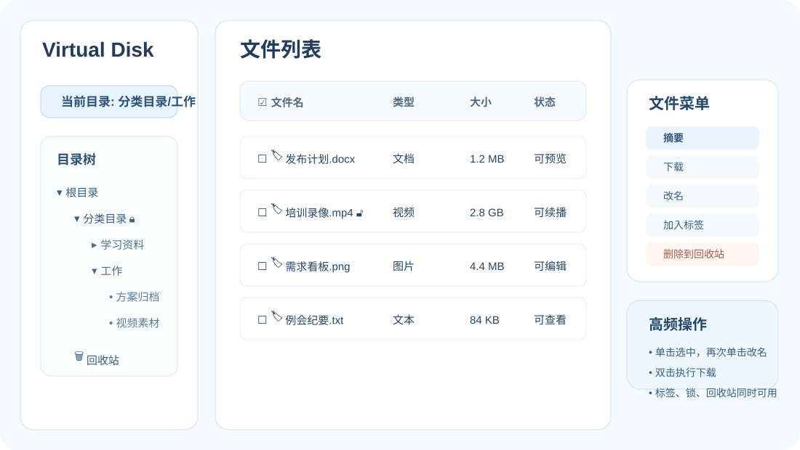

文件列表支持按名称、类型、大小、上传时间等维度排序，也支持单击选中、再次单击改名、双击下载。右键菜单提供摘要、下载、改名、删除、移除、加锁、解锁、去锁等操作，摘要窗口会展示文件名、大小、类型、创建时间和修改时间。

虚拟磁盘目录树包含根目录、普通目录和回收站。普通目录支持新建子目录、改名、复制、移动、删除、加锁、解锁和去锁；删除后的目录和文件会先进入 webcool 回收站，用户可以恢复或彻底删除。

远程复制、移动、上传等较重操作带有进度反馈和取消入口，适合处理大文件或批量数据。

## 二、本地磁盘：直接浏览服务器本机文件系统

webcool 不只管理上传目录，也支持浏览服务器本机磁盘。进入“本地磁盘”后，用户可以从当前用户目录、根目录、上一级目录等入口浏览文件系统，并选择是否显示隐藏文件。它既是上传面板，也是服务器侧文件浏览器。

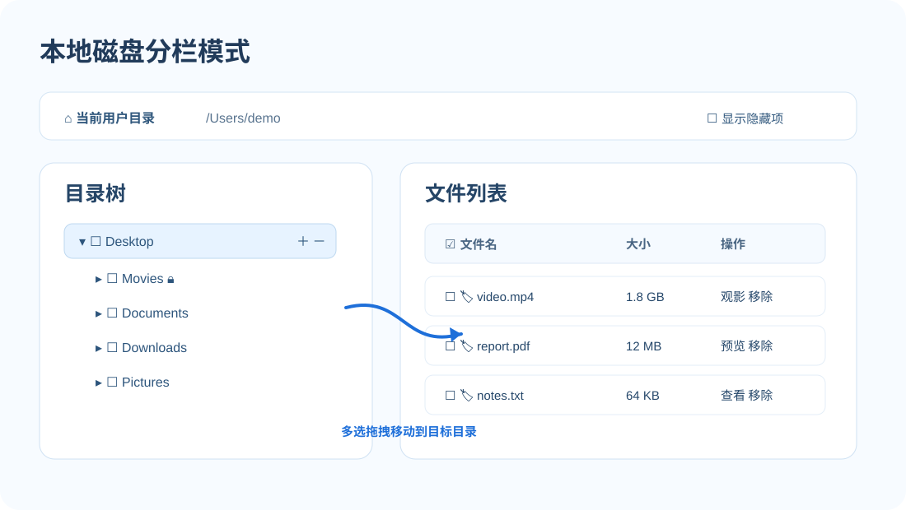

本地磁盘提供列表模式和分栏模式。列表模式适合快速查看当前目录；分栏模式提供目录树和右侧文件列表，适合在深层目录之间移动、复制或批量处理文件。

本地文件和目录支持排序、单选、多选、改名、复制、移动、下载、上传到虚拟磁盘、从虚拟磁盘复制到本地目录，以及删除到系统回收站。对于视频、音频、图片、PDF、文本、Office、Markdown、HTML 和 XMind 文件，界面会根据扩展名显示可用的预览入口。

本地磁盘也支持调用服务器本机应用打开文件或打开系统回收站；为了降低误操作风险，系统级目录移动和删除会受到额外限制。

## 三、回收站机制：删除前多一道保护

webcool 的删除策略强调安全性：远程虚拟磁盘中的文件和文件夹删除后进入 webcool 回收站；本地磁盘中的文件和目录删除时移动到系统回收站。

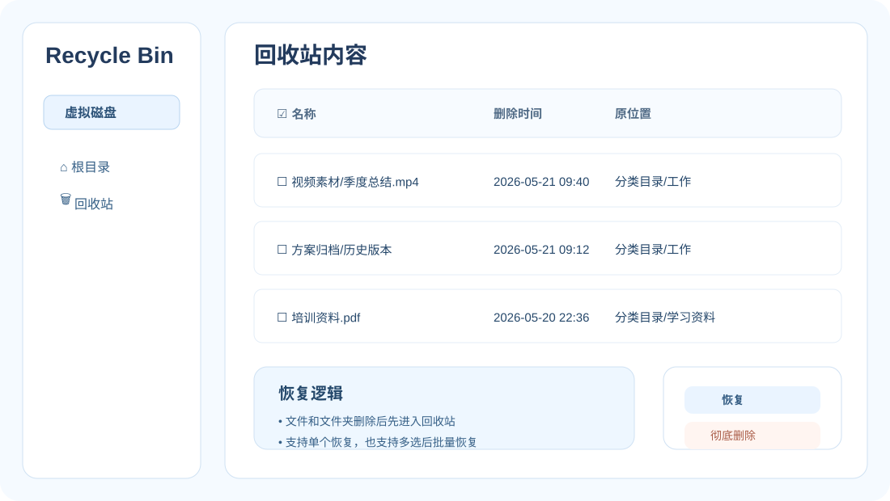

远程回收站支持恢复文件、恢复文件夹、批量恢复和彻底删除。标签视图中的“移除”只解除标签引用，不删除真实文件，避免用户在分类视图下误删原始数据。

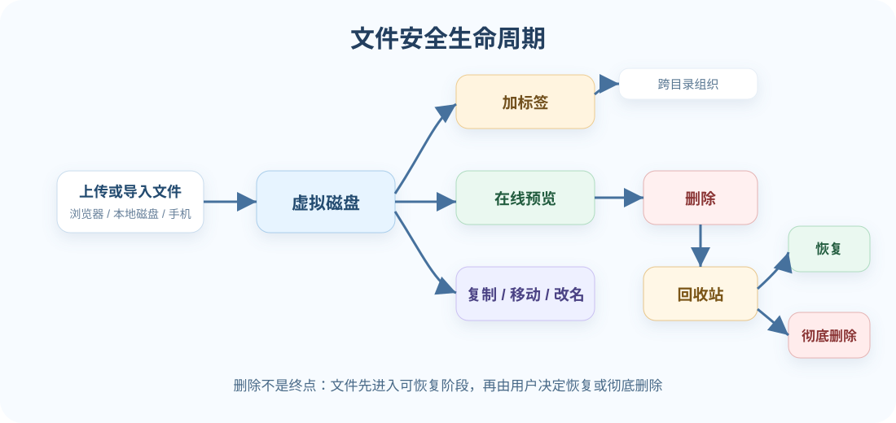

## 四、标签树：跨目录组织文件

目录适合按位置组织文件，标签适合按主题组织文件。webcool 提供独立标签树，支持视频、音频、图片、文档等保留标签，也支持用户自建多级标签。

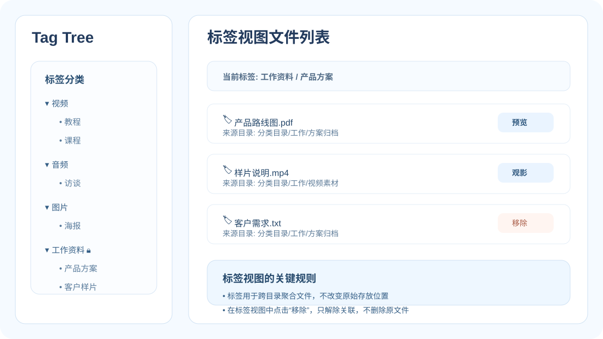

用户可以给远程文件和本地文件添加标签。文件列表中每个文件名前都有标签按钮，表头也提供批量加标签入口。标签视图会列出该标签引用的文件，移除动作只解除引用关系，不影响真实文件。

标签本身支持创建、改名、移动、删除、加锁、解锁和去锁。自建标签可以单独保护，适合对敏感分类、项目资料或家庭媒体库做访问控制。

## 五、加锁体系：目录、文件、标签都能保护

webcool 提供比较完整的加锁机制。远程目录、远程文件、本地目录、本地文件以及自建标签都可以加锁。

目录锁具有继承特性：父目录加锁后，其子目录和文件默认受到保护；子目录也可以单独加锁，子目录锁优先级高于父目录锁。解锁后，当前会话可以访问对应资源；点击打开锁图标可以重新锁定。

加锁、解锁、去锁和密码错误提示都使用界面弹窗完成。后端接口也会执行锁校验，下载、列表、复制、移动、改名、删除、预览等关键操作不会只依赖前端限制。

## 六、预览中心：不下载也能看、听、读、改

webcool 支持丰富的在线预览能力：

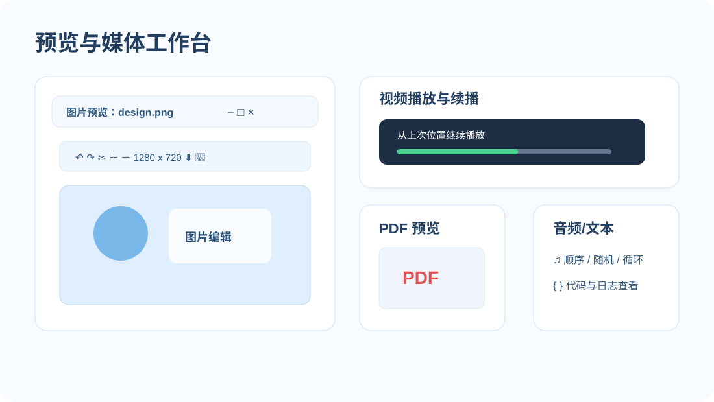

- **图片**：弹窗预览、上一张/下一张、最大化、旋转、裁剪、等比例缩放、非等比例缩放、保存到服务端、下载到本地，并包含 HEIC/HEIF 浏览器转换支持。
- **视频**：浏览器内在线播放，支持远程和本地视频续播，记录上次播放位置。
- **音频**：在线播放，支持顺序、随机、单曲循环和列表循环等播放方式。
- **PDF**：使用浏览器内置能力预览，可最大化阅读。
- **文本和代码**：直接弹窗查看，适合日志、配置文件、源码和普通 TXT。
- **Markdown**：支持预览模式和源码模式，适合文档资料快速阅读。
- **HTML**：以独立预览方式打开网页内容，便于查看静态页面或导出的 HTML 文档。
- **Office**：支持 docx、xlsx、pptx 等文档预览，前端内置文档、表格和演示文稿渲染支持；不可预览时可选择其他应用打开。
- **XMind**：支持思维导图文件预览，适合知识库和项目资料管理。

这些预览能力同时服务虚拟磁盘和本地磁盘，让文件内容可以直接在浏览器工作区中使用。

## 七、上传、导入与转码：从本地到虚拟磁盘的完整流程

webcool 支持选择文件上传、拖拽上传、批量上传，以及从本地磁盘选择文件或文件夹导入虚拟磁盘。上传前可以选择远程目标目录，上传过程中会显示真实进度、文件列表，并提供暂停、继续和取消入口。

对于视频类文件，webcool 会探测浏览器播放兼容性。例如某些 MP4 视频画面可播，但音频是 AC3，浏览器无法直接播放声音。webcool 会提示用户是否需要转码，并在用户确认后由后端处理为更兼容的格式。

转码任务支持后台执行、进度查询、任务列表和取消操作。ffmpeg 可以由安装包内置，也可以通过命令行指定：

```bash
webcool -F /custom/path/ffmpeg -s 0.0.0.0:8080 -d ./uploads
```

未传 `-F` 时，webcool 会按“运行参数 -> 环境变量 `AICOOL_FFMPEG` -> 安装路径/默认候选路径”的顺序自动选择可执行的 ffmpeg。

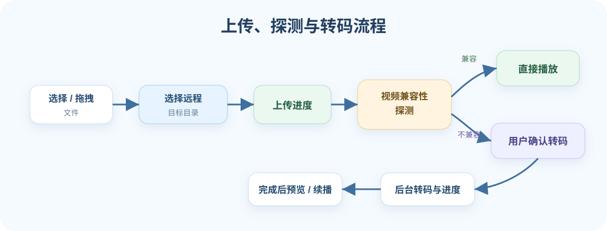

## 八、批量、拖拽与高效操作

webcool 支持多种接近桌面文件管理器的操作方式：

- 文件列表提供全选框和批量操作入口，可批量删除、移除、加标签、复制、移动和上传。
- 远程目录支持拖拽到回收站，也支持 Shift 多选后批量处理。
- 本地磁盘分栏模式支持选择多个文件或目录并拖拽到目标目录。
- 远程和本地之间支持导入、复制、上传和下载，适合把服务器本机资料整理进虚拟磁盘。
- 大文件复制、导入、上传和转码提供进度展示，必要时可取消。

## 九、系统管理：存储路径、备份同步、用户与偏好

webcool 提供系统管理模块，文件管理之外的关键配置集中在这里完成。

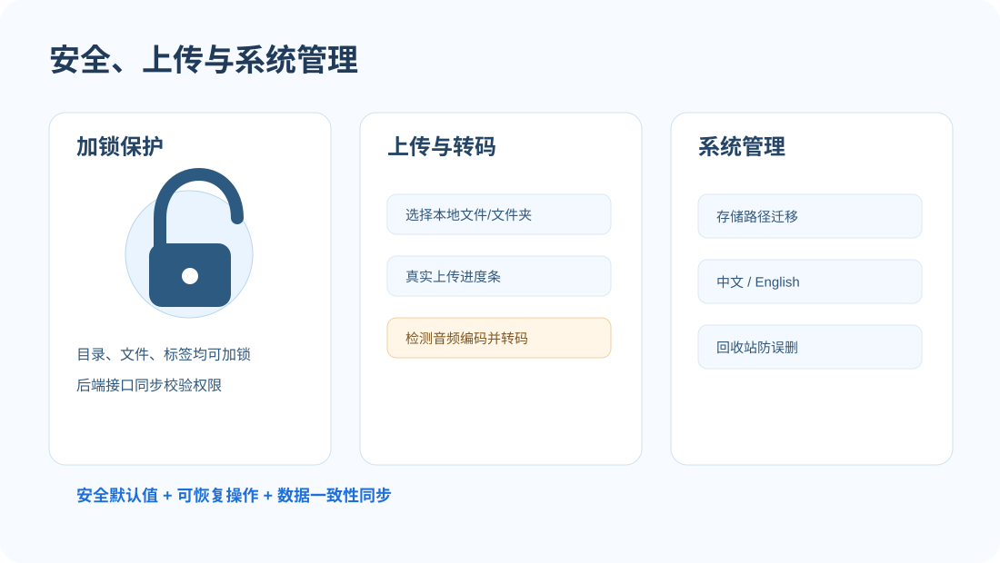

存储管理支持查看当前虚拟磁盘路径、选择新的存储目录、迁移已有数据、查看迁移进度、处理冲突和清理迁移状态。改变存储路径时，webcool 会要求确认是否迁移当前数据，避免路径切换后出现数据不一致。

备份管理支持添加备份路径，并提供上传数据自动同步开关和同步进度。对于长期运行的个人服务器，这能把上传数据复制到另一个本地目录，提高数据安全性。

本地磁盘设置用于控制服务器本机文件访问策略。账号模块支持登录、退出、修改密码、管理员查看用户列表、创建用户、更新用户和删除用户。账户设置支持语言和字体大小，偏好会保存在用户会话和后端配置中。

## 十、手机移动端：iPhone 与 Android 原生客户端

除了浏览器控制台，webcool 还提供 iOS 与 Android 移动端 App。两个客户端都直接调用同一套 `/api/v1/*` 后端接口，并通过 `Authorization: Bearer <auth_token>` 携带登录态，因此手机端和 Web 端共享同一套账号、目录、文件、标签、锁和权限模型。

移动端适合在家庭 Wi-Fi、办公室内网或私有云环境中随手访问 webcool。登录页支持手动填写服务地址，也支持扫描同一局域网内的 webcool 服务器，并维护常用服务器列表。

下面是一组 iOS App 运行截图，覆盖登录连接、虚拟磁盘、服务器磁盘、标签树、相册同步、文档预览、PDF 预览、投屏播放和账号设置等场景：

| 登录连接 | 虚拟磁盘 | 服务器磁盘 |
| --- | --- | --- |
| 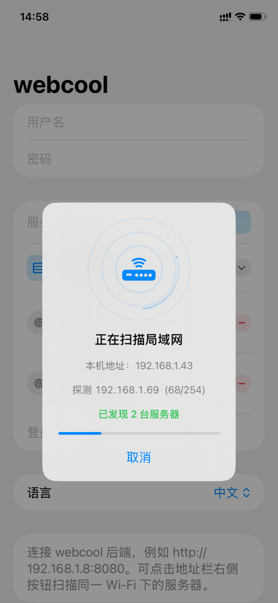 | 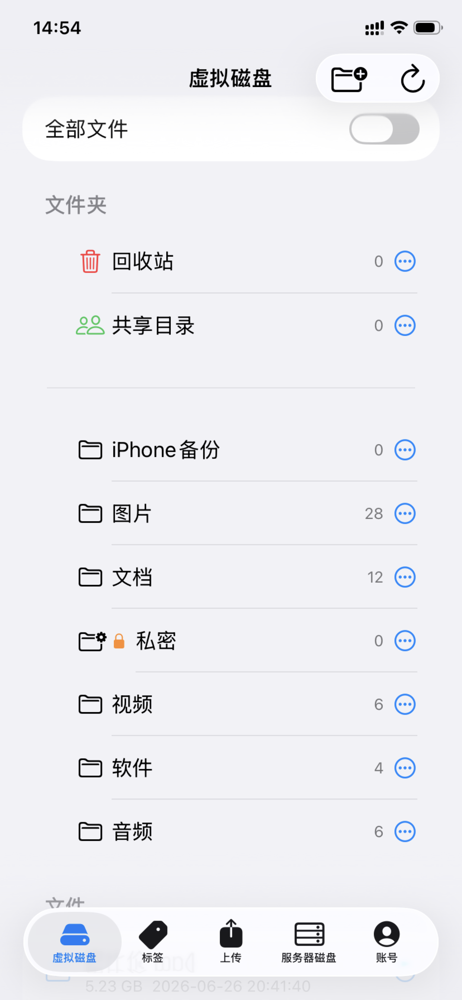 | 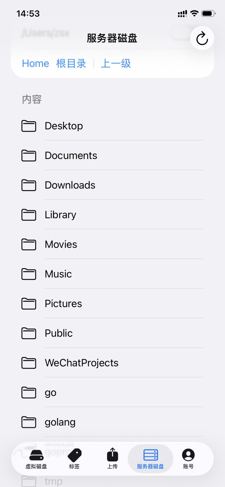 |
| 标签树 | 相册同步 | 文档预览 |
| 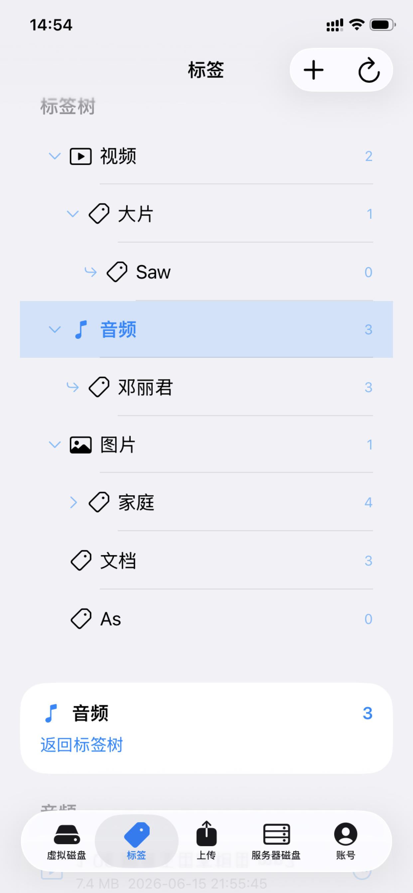 | 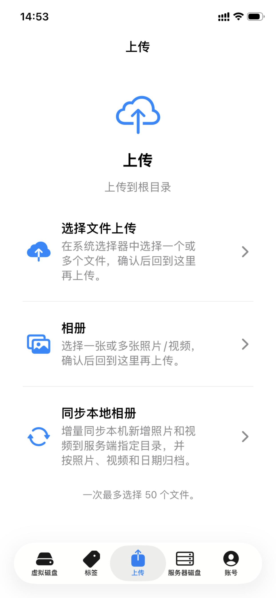 | 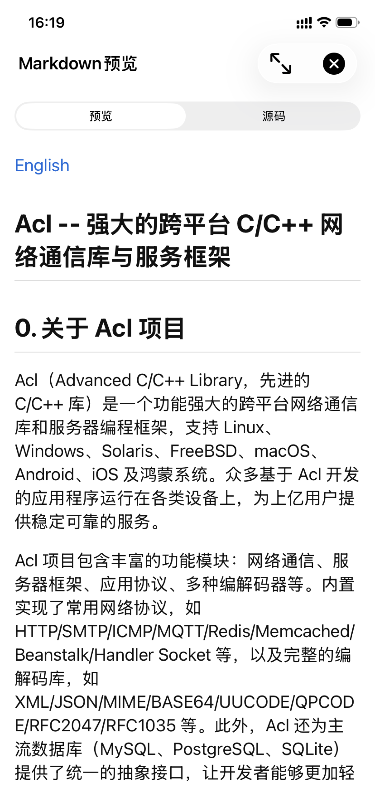 |
| PDF 预览 | 投屏播放 | 账号设置 |
| 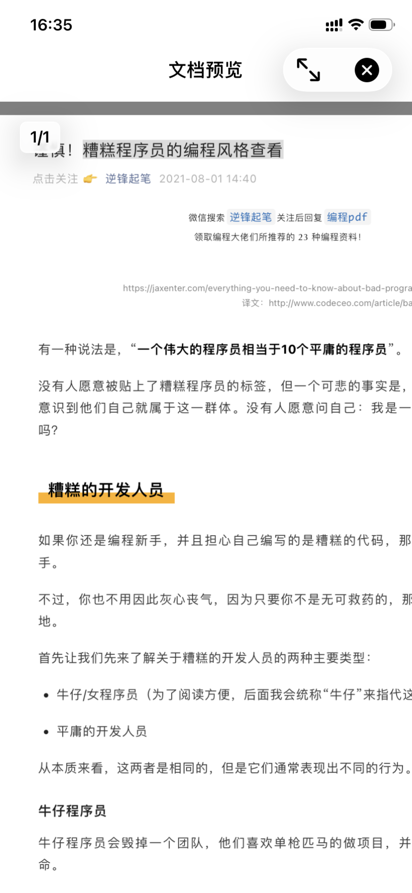 | 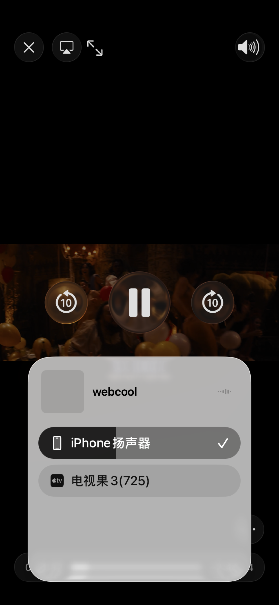 | 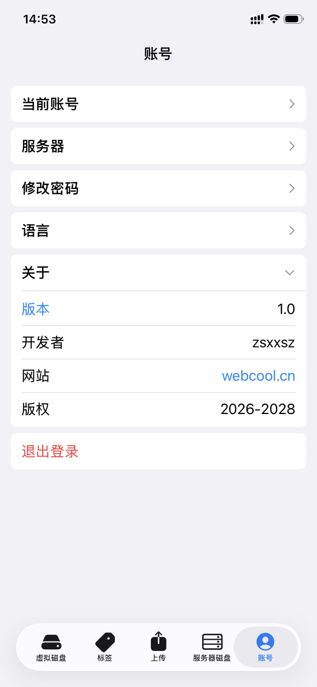 |

移动端当前覆盖的核心能力包括：

- **账号与连接**：登录、首次管理员注册、退出登录、修改密码、服务器地址保存、局域网扫描、版本检查。
- **虚拟磁盘**：目录树、文件列表、显示隐藏项、创建目录、删除/恢复文件、清空回收站、文件移动、复制、分享下载链接。
- **服务器磁盘**：在账号具备权限时浏览服务器本机目录，预览/分享文件，删除本地文件，并执行加锁、解锁和去锁。
- **标签树**：查看标签、查看标签下文件、创建/删除/移动标签、给文件加标签、移除标签引用。
- **锁机制**：远程目录、远程文件、本地文件/目录和标签的加锁、解锁、重新加锁、去锁能力与 Web 端后端校验保持一致。
- **上传能力**：iOS 使用系统文件选择器，当前一次最多选择 3 个文件；Android 使用系统文件选择器，当前一次最多选择 50 个文件。Android 还支持从系统相册选择照片/视频。
- **相册同步**：移动端提供本地相册同步入口，可将手机新增照片和视频增量同步到服务端指定目录，并按照片、视频和日期归档。
- **移动预览**：支持图片、视频、音频、PDF、Markdown、代码/文本、Office 文档等预览；图片可横竖屏预览，Office 无法内置预览时可选择其他应用打开。
- **下载、分享与缓存**：支持下载/分享文件，缓存远程文件到本机，并在账号页查看缓存数量和空间占用、清空缓存或删除单个本地缓存。
- **离线使用**：移动端提供手动离线模式，开启后预览和打开目录优先使用本地缓存，不主动访问服务器。

移动端源码目前暂未开源。Android 用户请前往 [webcool.cn/download](https://webcool.cn/download) 下载 Android App；iPhone 用户请在 Apple App Store 搜索并安装 webcool iOS App。移动端管理面板会优先保留高频文件操作；存储迁移、备份切换、转码任务管理等更偏桌面运维的功能仍建议在 Web 控制台完成。

## 十一、启动与部署

常用启动参数：

- `-h`：显示帮助。
- `-v`：输出版本号并退出。
- `-V`：输出详细信息并退出，包括版本、平台、监听地址、存储路径、sqlite 路径和 ffmpeg 路径。
- `-s addr`：指定监听地址，默认 `0.0.0.0:8080`。
- `-d upload_dir`：指定上传文件保存目录。存储路径优先级为 `$HOME/.webcool/primary_storage.path` -> `-d` -> 配置文件 `upload_dir` -> 平台默认路径。
- `-w html_home`：指定静态资源目录，默认 `./html`。
- `-S sqlite_lib`：指定 sqlite 动态库路径。
- `-F ffmpeg_path`：指定 ffmpeg 可执行文件路径。
- `-G`：打开 Windows/macOS 控制界面（这两个平台默认为窗口模式）。
- `-C`：在 Windows/macOS 上以命令行终端模式运行。

macOS 用户通过 Finder 启动时应双击 `webcool.app`，这样只会显示控制窗口，
不会同时打开 Terminal。

示例：

```bash
webcool -V
webcool -s 127.0.0.1:8080 -d ./uploads -w ./html
webcool -F /opt/webcool/bin/ffmpeg -S /usr/local/lib/sqlite3.so
```

项目提供 Web 服务端源码构建和桌面安装包构建说明，详见 [BUILD.md](BUILD.md) 与 [webcool/package/README.md](webcool/package/README.md)。移动端 App 请通过 webcool.cn/download 和 Apple App Store 获取。

## 十二、国际化与前端模块化

webcool 前端已经完成国际化整理，语言资源位于 `webcool/html/i18n/zh.js` 和 `webcool/html/i18n/en.js`，当前支持简体中文和英文。

前端主逻辑拆分在 `webcool/html/js/` 目录中，包括远程文件、本地磁盘预览、上传转码、存储管理、标签和锁上下文、Office/Markdown/HTML/XMind 预览等模块。主入口 `main.js` 负责按顺序加载这些模块并启动运行时。

这种结构让 webcool 后续继续扩展预览类型、系统设置或移动端协作能力时更容易维护。

## 十三、适合哪些使用场景

webcool 很适合以下场景：

- **家庭媒体库**：管理电影、课程、音乐、图片和字幕资料。
- **私有云文件中心**：在内网、家用 NAS 或个人服务器中管理文件。
- **开发者工作台**：浏览代码、日志、配置文件、PDF、Markdown 和 Office 文档。
- **知识库资料库**：用标签树组织文档、图片、音频、视频和 XMind 思维导图。
- **服务器本机文件控制台**：通过浏览器管理服务器本机文件系统。
- **手机随身文件库**：在 iPhone 或 Android 手机上访问内网 webcool，上传相册、预览文档、分享下载链接。
- **安全文件柜**：通过目录锁、文件锁、标签锁、账号体系和回收站保护敏感资料。
- **长期运行的数据空间**：通过存储迁移和备份同步降低维护成本。

## 总结

webcool 的特点是轻量但不简陋。它没有把自己限制成上传下载页面，而是逐步发展成一个完整的文件管理、内容预览、标签组织、安全保护、账号管理和系统运维平台。

远程虚拟磁盘让用户管理私有文件空间，本地磁盘让用户直接浏览服务器文件系统；标签树提供跨目录组织方式；回收站和加锁体系保障安全；多格式预览、图片编辑、视频续播、音频播放和转码让文件内容可以直接使用；存储迁移、备份同步、用户管理和个人偏好则补齐了长期运行所需的能力。

<a name="english"></a>
# webcool: A Versatile File Management Console for Personal and Private Environments

webcool has grown from a simple upload/download demo into a private file workspace that runs in the browser. It manages a remote virtual disk, browses the server's local disk, previews images, video, audio, PDFs, text, Markdown, HTML, Office documents, and XMind files, and includes tags, locks, recycle bin protection, batch operations, transcoding, image editing, user management, storage migration, backup sync, and user preferences.

If you want a lightweight but capable file management system for your computer, home server, workstation, NAS, or private cloud, webcool now covers both everyday file workflows and long-running administration tasks.


## Feature Overview

- **Virtual Disk**: Manage uploaded private files with a directory tree, file list, upload, download, copy, move, rename, delete, restore, and permanent delete.
- **Local Disk**: Browse the server's local file system with list/split modes, hidden-file toggle, sorting, copy, move, rename, delete to system trash, and open-with-local-app support.
- **Tag Tree**: Organize remote and local files across directories with multi-level tags. Removing an item from a tag only removes the reference.
- **Preview Center**: Open images, video, audio, PDFs, text, Markdown, HTML, Office documents, and XMind mind maps directly in the browser.
- **Security**: Remote recycle bin, system trash, directory locks, file locks, tag locks, session unlocks, and backend API verification work together.
- **System Management**: Storage path switching, migration progress, conflict handling, backup paths, automatic upload-data sync, local disk policy, language, and font size.
- **Accounts**: Login, logout, password change, user administration, and persisted user preferences.
- **Mobile Clients**: Native iPhone and Android clients can discover servers on the same Wi-Fi, browse the virtual disk and server disk, upload photos or files, preview documents and media, and share the same login, tag, lock, and cache model.

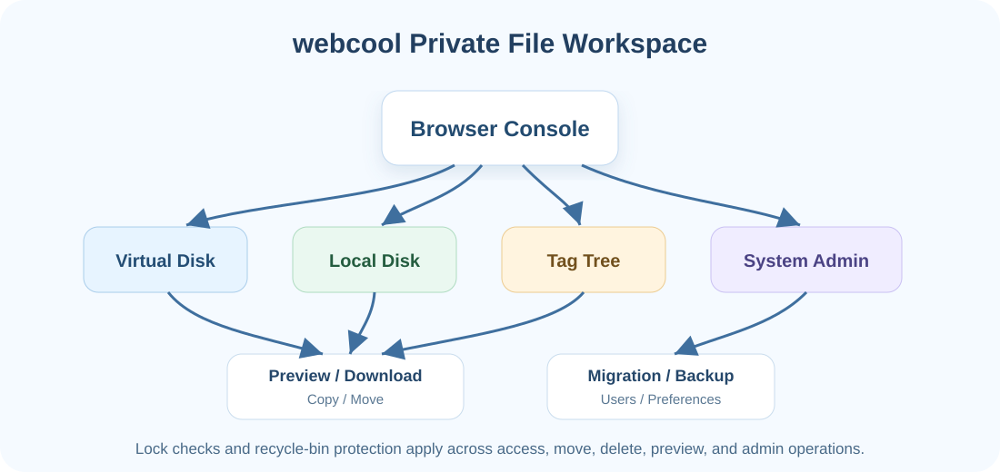

## 1. Virtual Disk

The virtual disk is webcool's core file management area. Users can browse remote storage directories, create folders, rename folders, copy/move folders, delete folders to the recycle bin, and perform preview, download, rename, copy, move, delete, tag, and lock operations on files.


The file list supports sorting by name, type, size, upload time, and more. A single click selects a file, clicking again starts rename mode, and double-clicking downloads it. Context menus provide summary, download, rename, delete/remove, lock, unlock, and remove-lock actions.

The directory tree includes the root, regular folders, and the recycle bin. Deleted files and folders first enter webcool's recycle bin and can later be restored or permanently deleted. Heavy operations such as remote copy, move, and upload expose progress feedback and cancellation controls.

## 2. Local Disk

webcool can also browse the server's local file system. Users can start from the current user directory, root directory, parent directory, and other entries, with an option to show hidden files.


The local disk provides list mode and split mode. It supports sorting, single/multiple selection, rename, copy, move, download, upload to the virtual disk, copy from the virtual disk into a local folder, and delete to the system trash.

Local files can be previewed or opened depending on their type, including video, audio, images, PDFs, text, Office documents, Markdown, HTML, and XMind files. The backend can also open a file with a local application or open the system trash. Risky operations on system-level directories are restricted.

## 3. Recycle Bin

webcool's deletion model favors recoverability. Remote files and folders go to webcool's recycle bin. Local files and folders go to the operating system's trash.


The remote recycle bin supports file/folder restore, batch restore, and permanent delete. In tag views, remove only unbinds the tag reference and does not delete the real file.

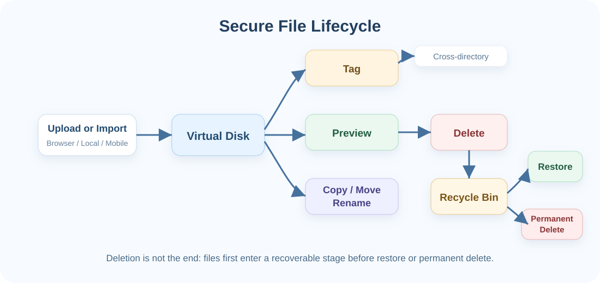

## 4. Tag Tree

Folders organize by location; tags organize by topic. webcool provides a multi-level tag tree with reserved tags for media/document categories and user-defined tags.


Remote and local files can be bound to tags individually or in batches. A tag view lists referenced files, and removal only deletes the relationship. Tags themselves support create, rename, move, delete, lock, unlock, and remove-lock operations.

## 5. Locking System

Remote folders, remote files, local folders, local files, and user-defined tags can all be locked.

Directory locks are inherited: when a parent folder is locked, child folders and files are protected by default. Child folders can still be locked separately, and their own locks take precedence. Unlocking applies to the current session, and an opened lock icon can be clicked to lock again.

The backend enforces lock checks for important operations such as download, list, copy, move, rename, delete, and preview, so protection does not depend only on frontend UI state.

## 6. Preview Center

webcool supports rich in-browser preview:


- **Images**: Popup preview, previous/next navigation, maximize, rotate, crop, proportional/non-proportional scaling, save back to the server, download locally, plus HEIC/HEIF conversion support.
- **Video**: Browser playback with resume support for both remote and local videos.
- **Audio**: Browser playback with sequential, random, single-loop, and list-loop modes.
- **PDF**: Browser-based PDF preview with maximized reading.
- **Text and code**: Quick reading for logs, config files, source files, and TXT.
- **Markdown**: Preview and source modes.
- **HTML**: Standalone preview for static pages or exported HTML documents.
- **Office**: docx, xlsx, and pptx preview using bundled frontend renderers, with open-with-other-app fallback.
- **XMind**: Mind map preview for knowledge-base and project documents.

## 7. Upload, Import, and Transcoding

webcool supports file selection, drag-and-drop upload, batch upload, and importing files or folders from the local disk into the virtual disk. Uploads show real progress, selected-file lists, and pause/resume/cancel controls.

For video files, webcool probes browser playback compatibility. If a file needs conversion, such as an MP4 with AC3 audio, the UI prompts the user before backend transcoding starts.

Transcoding runs in the background and supports progress polling, task listing, and cancellation. ffmpeg can be bundled by installers or specified manually:

```bash
webcool -F /custom/path/ffmpeg -s 0.0.0.0:8080 -d ./uploads
```

Without `-F`, webcool chooses ffmpeg in this order: runtime option -> `AICOOL_FFMPEG` -> install/default candidate paths.

## 8. Batch and Drag Operations

webcool supports efficient desktop-like operations:

- Select-all and batch actions for delete/remove, tag, copy, move, and upload.
- Drag remote folders to the recycle bin, including Shift multi-select flows.
- Drag multiple local files or folders in split mode.
- Move data between the virtual disk and local disk through import, copy, upload, and download.
- Track and cancel long-running upload, copy, import, and transcode operations.

## 9. System Management

webcool centralizes runtime administration outside the file list.


Storage management shows the current virtual disk path, lets users choose a new storage path, migrates existing data, reports progress, resolves conflicts, and cleans migration state. Backup management supports backup paths, automatic upload-data sync, and sync progress.

Local disk settings control server-side file access behavior. Account features include login, logout, password change, admin user list, user creation, user updates, and deletion. Account preferences include language and font size, stored in both session and backend preferences.

## 10. Mobile Clients: iPhone and Android

In addition to the browser console, webcool provides native iOS and Android apps. Both clients call the same `/api/v1/*` backend APIs and use `Authorization: Bearer <auth_token>` for authentication, so mobile and Web share the same accounts, folders, files, tags, locks, and permission model.

The mobile clients are designed for home Wi-Fi, office intranet, NAS, and private cloud usage. The login screen supports manual server URLs, LAN server discovery, and a saved server list for frequently used webcool hosts.

The following iOS runtime screenshots show login/connection, virtual disk, server disk, tag tree, album sync, document preview, PDF preview, casting/playback, and account settings:

| Login | Virtual Disk | Server Disk |
| --- | --- | --- |
|  |  |  |
| Tags | Album Sync | Document Preview |
|  |  |  |
| PDF Preview | Casting | Account |
|  |  |  |

Current mobile capabilities include:

- **Accounts and connection**: Login, first-admin registration, logout, password change, saved server URLs, LAN scan, and version checks.
- **Virtual disk**: Directory tree, file list, hidden-item toggle, folder creation, file delete/restore, recycle-bin emptying, file move/copy, and shareable download links.
- **Server disk**: Browse server-side local directories when the account has permission, preview/share files, delete local files, and lock/unlock/remove locks.
- **Tag tree**: View tags, browse files under tags, create/delete/move tags, add tags to files, and remove tag references.
- **Locks**: Folder, file, local item, and tag lock/unlock/relock/remove-lock behavior follows the same backend checks as the Web console.
- **Uploads**: iOS uses the system file picker and currently uploads up to 3 files at once. Android uses the system file picker and currently uploads up to 50 files at once. Android also supports choosing photos/videos from the system album.
- **Album sync**: Mobile clients provide an album sync flow for incrementally uploading new photos and videos to a selected server folder, organized by photos, videos, and date.
- **Mobile preview**: Images, video, audio, PDF, Markdown, code/text, and Office documents can be previewed on device. Images support portrait/landscape preview, and Office files can fall back to another app when needed.
- **Download, share, and cache**: Files can be downloaded/shared, cached locally, inspected from the account page, cleared from cache, or removed individually from local cache.
- **Offline mode**: Manual offline mode makes previews and folder browsing prefer local cache without actively contacting the server.

The mobile source code is not open-sourced yet. Android users should download the Android app from [webcool.cn/download](https://webcool.cn/download). iPhone users should install the webcool iOS app from the Apple App Store. Mobile screens focus on frequent file workflows; storage migration, backup switching, and transcode task administration are still better handled from the Web console.

## 11. Startup and Deployment

Common options:

- `-h`: Show help.
- `-v`: Print version and exit.
- `-V`: Print detailed version/runtime information.
- `-s addr`: Listen address, default `0.0.0.0:8080`.
- `-d upload_dir`: Upload directory. Storage path priority is `$HOME/.webcool/primary_storage.path` -> `-d` -> config `upload_dir` -> platform default.
- `-w html_home`: Static resource directory, default `./html`.
- `-S sqlite_lib`: sqlite dynamic library path.
- `-F ffmpeg_path`: ffmpeg executable path.
- `-G`: Open the Windows/macOS control panel (the default mode on these platforms).
- `-C`: Run in command-line terminal mode on Windows/macOS.

On macOS, double-click `webcool.app` in Finder to open only the control window
without launching Terminal.

Examples:

```bash
webcool -V
webcool -s 127.0.0.1:8080 -d ./uploads -w ./html
webcool -F /opt/webcool/bin/ffmpeg -S /usr/local/lib/sqlite3.so
```

Build and desktop packaging details are documented in [BUILD.md](BUILD.md) and [webcool/package/README.md](webcool/package/README.md). Mobile apps are distributed through webcool.cn/download and the Apple App Store.

## 12. Internationalization and Frontend Modules

Frontend language resources live in `webcool/html/i18n/zh.js` and `webcool/html/i18n/en.js`, currently supporting Simplified Chinese and English.

The browser code is split under `webcool/html/js/`, including modules for remote files, local disk preview, upload/transcoding, storage administration, tags and locks, Office/Markdown/HTML/XMind preview, and runtime bootstrapping. `main.js` loads the modules and starts the app.

## 13. Good Fits

webcool is useful for:

- **Home media libraries**: Movies, courses, music, images, and subtitle assets.
- **Private cloud file centers**: Intranet, NAS, home server, or personal workstation files.
- **Developer workstations**: Code, logs, config files, PDFs, Markdown, and Office documents.
- **Knowledge bases**: Documents, images, audio, video, and XMind files organized by tags.
- **Server local file consoles**: Browser-based management of server-side files.
- **Mobile personal file library**: Access webcool from iPhone or Android, upload albums, preview documents, and share download links.
- **Secure file cabinets**: Locks, accounts, and recycle-bin protection for sensitive files.
- **Long-running storage spaces**: Migration and backup sync for easier maintenance.

## Summary

webcool is lightweight, but it is not a toy upload page. It has evolved into a complete platform for file management, content preview, tag organization, security protection, user administration, and system operations.

The virtual disk manages private storage, the local disk browses the server file system, tags organize files across directories, locks and recycle bins protect data, rich previews make content usable in place, and migration, backup sync, users, and preferences make the system practical for long-term use.
